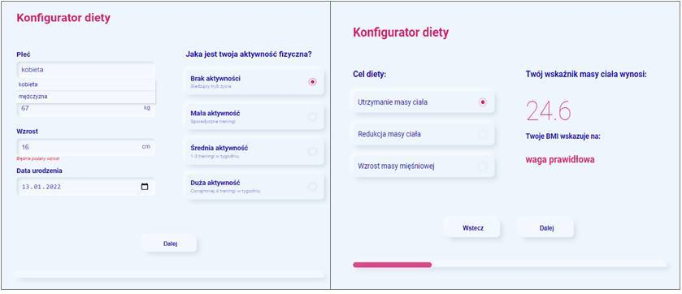
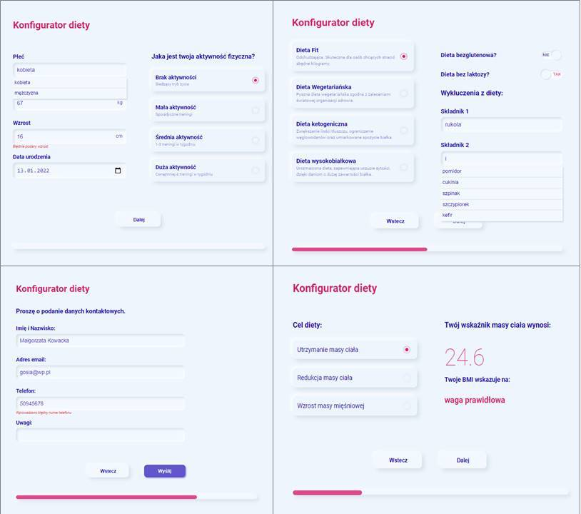

# Diet form with calculator BMI

&nbsp;

## Table of contents

[⭐ Overview](#⭐-overview)
  - [The challenge](#the-challenge)
  - [Instalation](#Installation-💿)
  - [Links](#links)

[💡 My process](#💡-my-process)
  - [Technologies](#Technologies)
  - [Solutions provided in the project](#Solutions-provided-in-the-project)
  - [Ideas to develop the app](#Ideas-to-develop-the-app)
  - [Useful resources](#useful-resources)

[Screenshot](#screenshot)

[🙋‍♂️ Author](#🙋‍♂️-author)

[👏 Special Thanks](#👏-special-thanks)

&nbsp;

## ⭐ Overview

&nbsp;

### **The challenge:**

It was my first small project using `React` and `styled-components`.
The challenge was to create a user interface for ordering a diet (with a BMI calculator) using the principles of neumorphism.

To familarize with the concept of neumorphism I recommend a few article:

- [Neumorphism in user interfaces](https://uxdesign.cc/neumorphism-in-user-interfaces-b47cef3bf3a6)
- [Neumorphism: why it’s all the hype in UI design](https://www.justinmind.com/blog/neumorphism-ui/)
- [Neumorphism. The Next Big Thing In UI Design?](https://opengeekslab.com/blog/neumorphism-the-next-big-thing-ui-design/)

My task was to create a few components in line with this trend using Styled Components.

The App:

- consists of four stages on which you can move comfortably.
- The level of filling the stages is shown by created progress bar.
- The user is informed after entering incorrect data.
- Moreover, the app includes a BMI calculator.

&nbsp;

### **Installation 💿**

The project uses [node](https://nodejs.org/en/), [npm](https://www.npmjs.com/), [webpack](https://webpack.js.org/) and compiler [babel](https://babeljs.io/setup#installation) as well as package [JSON-server](https://www.npmjs.com/package/json-server) and [whatwg-fetch](https://github.com/github/fetch).

Having them installed, type into the terminal: 
```
npm i
```
Then, you may run webpack typing in the terminal:

```
npm start
```

To run JSON-Server, type in the second terminal:
``` 
json-server --watch ./src/db/data.json
```
App is available using the following addresses:

http://localhost:8080

&nbsp;

### **Links:**
- [GitHub](https://github.com/kowackag/diet-form-and-calc-BMI)

&nbsp;
 
## 💡 My process

&nbsp;

### **Technologies:**


&nbsp;
  
### **Solutions provided in the project:**
- HTML:
    - The project was built using semantic HTML5 markup.
- CSS:
    - The css styles are created using `styled-components`.
    - It was prepared only desktop app (mobile and tablet in the feature)
    - I tried to create all form fields in line with the `neumorphism` trend.
    - The `Custom Checkbox` and `Radio` was created.
    - Also with the `neumorphism` trend, It was created from scratch dropdown list (Search Component) similar to `select`/`option`.
- JS:
    - ES2015+ (arrow functions, destructuring, spread operator) was used.
    - To store all communication with the API in one place, the function DataAPI was created (in the separated file `DataAPI.js`).
    - Communication with API is based on `fetch()` method.
    - To run the project using browsers that do not support `fetch()` method, package `whatwg-fetch` was used.
    - All fields are validated also using `RegExr`.
- React:
    - The following hooks were used: `useState`, `useEffect` and `useReducer`.
    - Components are split and kept as simple as possible.


I had opted to use `styled-components` as a solution for managing the CSS.

To make coding with `styled-component` more comfortable, I used a special Extension in Visual Studio Code `vscode-styled-components`.

I used the `createGlobalStyle` function from styled-components and added reset style and some global styles (`Reset.js` and `Global.js`)

```
import {createGlobalStyle} from 'styled-components';

const GlobbalStyle = createGlobalStyle`
    @font-face {
        font-family: "Roboto";
        font-style: regular;
        font-weight: 400;
        src:
        url("./../fonts/roboto-regular-webfont.woff2") format('woff2'),
        url('./../fonts/roboto-regular-webfont.woff') format('woff');
    }
    // ...
```
Hook `useReducer` is used to control the form with user inputs. Thanks to destructuring it is possible to conveniently store data.

```
const reducer = (state, {type, element}) => {
        switch (type) {
        case 'reset':
            return init;
        case 'change':
            const {name, value} = element;
            return {...state, [name]:value};
        default:
            return state;
        }
    }
```

### **Ideas to develop the app:** 

Firstly, I will create a tablet and mobile app. Next, I would like to develop theme.js to provide more  coloristic options. Moreover, the extending fields validation might be good idea. Finally, I would like to add the option of sending e-mails with user data, using e.g. [emailjs.com](https://www.emailjs.com/).

### **Useful resources:**

- [css code generator](https://neumorphism.io/)
- [Google Font](https://fonts.google.com/specimen/Roboto) - `Roboto`
- [inspiration](https://bashooka.com/inspiration/neumorphism-ui-design-examples/)

&nbsp;

## **Screenshot:**
&nbsp;




## 🙋‍♂️ Author

The project was made by Małgorzata Kowacka.
- kowackag@gmail.com
- GitHub - [kowackag](https://github.com/kowackag)
- Linked - [Małgorzata Kowacka](https://www.linkedin.com/in/ma%C5%82gorzata-kowacka-0258a812a/)

 **If you have any questions do not hesitate to contact me.**

&nbsp;

## 👏 Special thanks  
Thanks to my [Mentor - devmentor.pl](https://devmentor.pl/) - for providing me with this task and for code review.

&nbsp;